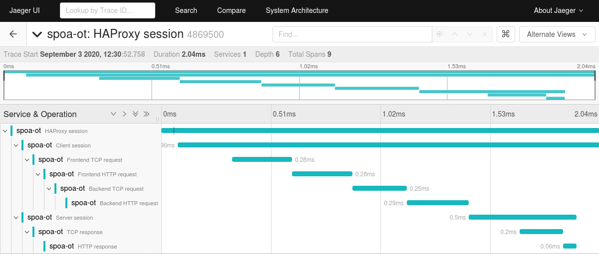
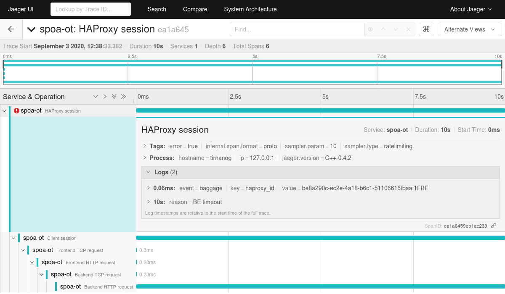

# **spoa-opentracing for HAProxy**
- [**spoa-opentracing for HAProxy**](#spoa-opentracing-for-haproxy)
    + [1. Introduction](#1-introduction)
    + [2. Build instructions](#2-build-instructions)
        * [Prerequisites for configuring and compiling the program:](#prerequisites-for-configuring-and-compiling-the-program)
        * [Compiling and installing the opentracing-cpp library:](#compiling-and-installing-the-opentracing-cpp-library)
        * [Compiling and installing the opentracing-c-wrapper library:](#compiling-and-installing-the-opentracing-c-wrapper-library)
        * [Compiling the Jaeger tracing plugin:](#compiling-the-jaeger-tracing-plugin)
        * [Creating the build subsystem for the program (configure script):](#creating-the-build-subsystem-for-the-program-configure-script)
        * [Configuring the program:](#configuring-the-program)
        * [Compiling the program:](#compiling-the-program)
    + [3. Use of the program](#3-use-of-the-program)
        * [Example of using the program:](#example-of-using-the-program)
        * [Jaeger docker image installation:](#jaeger-docker-image-installation)
    + [4. Basic concepts in the OpenTracing](#4-basic-concepts-in-the-opentracing)
    + [5. SPOE configuration](#5-spoe-configuration)
    + [6. Tracing example (the one from the test directory)](#6-tracing-example-the-one-from-the-test-directory)
    + [7. Benchmarking results](#7-benchmarking-results)
    + [8. Known bugs and limitations](#8-known-bugs-and-limitations)


### 1. Introduction
This is a very simple program that allows you to send data to distributed tracing systems via the OpenTracing API, using the HAProxy SPOP; i.e. Stream Processing Offload Protocol.

The program originated from a test program located in the contrib/spoa_example directory.  spoa.c is an original program that comes with HAProxy source.

The program uses the libev event library, as opposed to the original program that uses the libevent library.


### 2. Build instructions

##### Prerequisites for configuring and compiling the program:

  * GNU GCC Compiler and Development Environment
    The main components of this system are C standard library, C and C++ compilers, make and cmake utilities and other development tools that are not explicitly listed because they depend on the system on which we want to compile the program.

    The program itself is very likely possible to compile with another C compiler (non-GCC), but I'm not sure about the other required libraries.

    On debian-like linux systems it is necessary to run the following, in order to install development packages:

```
sudo apt-get install automake autoconf make cmake libc6-dev gcc g++ binutils libev-dev libtool pkgconf gawk git
```

  * [GNU autoconf](https://www.gnu.org/software/autoconf/)

  * [GNU automake](https://www.gnu.org/software/automake/)

  * POSIX threads library

  * [libev library](http://software.schmorp.de/pkg/libev.html)

  * [C++ implementation of the OpenTracing API http://opentracing.io](https://github.com/opentracing/opentracing-cpp)

  * [C wrapper for the opentracing-cpp library](https://github.com/haproxytech/opentracing-c-wrapper)

  * the tracing plugins (one of the following may be used):
    * [Jaeger SDK with OpenTracing API for C++ binding](https://github.com/jaegertracing/jaeger-client-cpp)

    * [the LightStep distributed tracing library for C++](https://github.com/lightstep/lightstep-tracer-cpp)

    * [OpenTracing implementation for Zipkin in C++](https://github.com/rnburn/zipkin-cpp-opentracing)

    * [Datadog OpenTracing C++ Client](https://github.com/DataDog/dd-opentracing-cpp)

##### Compiling and installing the opentracing-cpp library:

The assumption is that we want to install the library in the /opt directory.

```
wget https://github.com/opentracing/opentracing-cpp/archive/v1.5.0.tar.gz
tar xf v1.5.0.tar.gz
cd opentracing-cpp-1.5.0
mkdir build
cd build
cmake -DCMAKE_INSTALL_PREFIX=/opt ..
make
sudo make install
```

Of course, we can take another version of the library (or download the master branch via git).  For example, this version is used here due to compatibility with the Jaeger plugin, which I mostly used when testing the operation of the program.

##### Compiling and installing the opentracing-c-wrapper library:

We will also install this library in the /opt directory, and when configuring the library we must specify where the opentracing-cpp library is located.

In this example we will install two builds of the library, first the release version and then the debug version.

```
git clone https://github.com/haproxytech/opentracing-c-wrapper.git
cd opentracing-c-wrapper
./scripts/bootstrap
./configure --prefix=/opt --with-opentracing=/opt
make
sudo make install

./scripts/distclean
./scripts/bootstrap
./configure --prefix=/opt --enable-debug --with-opentracing=/opt
make
sudo make install
```

##### Compiling the Jaeger tracing plugin:

We will use the 1.5.0 version of the plugin, a newer one can be taken (or the git master branch) if you want to try it (as is the case with previous libraries, you can try a newer version).

Important note: the GCC version must be at least 4.9 or later.

```
wget https://github.com/jaegertracing/jaeger-client-cpp/archive/v0.5.0.tar.gz
tar xf v0.5.0.tar.gz
cd jaeger-client-cpp-0.5.0
mkdir build
cd build
cmake -DCMAKE_INSTALL_PREFIX=/opt -DJAEGERTRACING_PLUGIN=ON -DHUNTER_CONFIGURATION_TYPES=Release -DHUNTER_BUILD_SHARED_LIBS=OFF ..
make
```

After the plugin is compiled, it will be in the current directory.  The name of the plugin is libjaegertracing_plugin.so.

Of course, we can download the precompiled version of the Jaeger plugin (unfortunately, the latest version that can be downloaded is 0.4.2).

```
wget https://github.com/jaegertracing/jaeger-client-cpp/releases/download/v0.4.2/libjaegertracing_plugin.linux_amd64.so
```

##### Creating the build subsystem for the program (configure script):

```
./scripts/bootstrap
```

##### Configuring the program:

```
./configure --with-libev[=DIR] --with-opentracing[=DIR]
```

The program can be configured with debugging features enabled, but it is not recommended for actual use:

```
./configure --enable-debug --with-libev[=DIR] --with-opentracing[=DIR]
```

To configure the program, the system must have installed development packages for opentracing-c-wrapper and libev; which will be selected automatically when running the configure script, if their path is not specified explicitly.

##### Compiling the program:

```
make all
```

After that, in the directory src will be located spoa-opentracing program.


### 3. Use of the program

The options supported by the program can be found using the '-h' option:

```
./src/spoa-opentracing -h

Usage: spoa-opentracing { -h --help }
       spoa-opentracing { -V --version }
       spoa-opentracing { -r --runtime=TIME } [OPTION]...

Options are:
  -a, --address=NAME              Specify the address to listen on (default: "0.0.0.0").
  -B, --libev-backend=TYPE        Specify the libev backend type (default: AUTO).
  -b, --connection-backlog=VALUE  Specify the connection backlog size (default: 10).
  -c, --capability=NAME           Enable the support of the specified capability.
  -D, --daemonize                 Run this program as a daemon.
  -d, --debug=LEVEL               Enable and specify the debug mode level (default: 129).
  -F, --pidfile=FILE              Specifies a file to write the process-id to.
  -h, --help                      Show this text.
  -i, --monitor-interval=TIME     Set the monitor interval (default: 5.00s).
  -l, --logfile=[MODE:]FILE       Log all messages to logfile (default: stdout/stderr).
  -m, --max-frame-size=VALUE      Specify the maximum frame size (default: 16384 bytes).
  -n, --num-workers=VALUE         Specify the number of workers (default: 10).
  -p, --port=VALUE                Specify the port to listen on (default: 12345).
  -r, --runtime=TIME              Run this program for the specified time (0 = unlimited).
  -t, --processing-delay=TIME     Set a delay to process a message (default: 0).
  -o, --ot-timeout-msg=STR        Specify a timeout log message (default: "connection timeout").
  -C, --ot-tracer-config=FILE     Specify the configuration of the used tracer.
  -T, --ot-tracer-plugin=FILE     Specify the OpenTracing compatible plugin library.
  -V, --version                   Show program version.

Supported libev backends: select, poll, epoll, linuxaio.

Supported capabilities: fragmentation, pipelining, async.

Allowed logging file opening modes: a, w.  The 'a' mode allows openning or
creating file for writing at end-of-file.  The 'w' mode allows truncating
the file to zero length or creating a new file.  If a capital letter is used
for the mode, then line buffering is used when writing to the log file.

The time delay/interval is specified in milliseconds by default, but can be
in any other unit if the number is suffixed by a unit (us, ms, s, m, h, d).

Copyright 2020 HAProxy Technologies
SPDX-License-Identifier: GPL-2.0-or-later
```


The program simultaneously supports short and long format options.

The test directory contains the configuration files for HAProxy (haproxy.cfg) and SPOE (spoe.cfg).  ssl-cert.pem is a certificate intended for testing if we want to use HTTPS HAProxy frontend.

During the normal work of the program, should be placed under the comment the following lines in the spoe.cfg:

```
messages check-client-ip
messages test
```

These two rows can be used when debugging the program, especially if it is configured with the option --enable-debug.


##### Example of using the program:

```
./src/spoa-opentracing -r0 -Ctest/cfg-jaeger.yml -Ttest/libjaeger_opentracing_plugin-0.4.2.so
```

'-r' is the option that must be specified when launching a program.  It is used to prevent the program from starting unnecessarily when testing the program options, or printing the program help.  In addition, with this option, the program runtime is set.  If the time is set to 0, the program runtime is unlimited.

With the '-C' option, we specify the configuration of the used tracer (in this case it is Jeager); while the '-T' option selects the plugin library that the selected tracer uses.

After that, the HAProxy should be started, using haproxy.cfg configuration file:

```
/path-to/haproxy -f haproxy.cfg
```

Of course, we can also use the master-worker mode of HAProxy and specify the command to start the program directly in the configuration.  In that case we just need to run the HAProxy which will run the program on its own.

The test directory contains several HAProxy configurations prepared for different modes of operation, as well as configurations for supported tracers.

The HAProxy configurations:
  - haproxy.cfg     - simple configuration with defined SPOE filter
  - haproxy-htx.cfg - configuration similar to the above using the HTTPS
                      protocol
  - haproxy-mw.cfg  - master-worker configuration

Configurations for the selected tracer type:
  - cfg-dd.json     - Datadog tracer
  - cfg-jaeger.yml  - Jaeger tracer
  - cfg-zipkin.json - Zipkin tracer

SPOE configuration (The OpenTracing Data Model):
  - spoe.cfg - universal SPOE configuration that can be used with any tracer

SSL certificate used if we run HAProxy in HTTPS mode:
  - ssl-cert.pem

Script to download all supported tracer plugins:
  - get-opentracing-plugins.sh - using this script we can download the latest
    versions of tracer plugins (the latest versions that are available as a
    pre-compiled plugin, this does not mean that they are the latest versions
    of the current source)


##### Jaeger docker image installation:

  Installation instructions can be found on the website https://www.jaegertracing.io/download/.  For the impatient, here we will list how the image to test the operation of the tracer system can be installed without much reading of the documentation.

```
sudo docker pull jaegertracing/all-in-one:latest
sudo docker run -d --name jaeger -e COLLECTOR_ZIPKIN_HTTP_PORT=9411 -p 5775:5775/udp -p 6831:6831/udp -p 6832:6832/udp -p 5778:5778 -p 16686:16686 -p 14268:14268 -p 9411:9411 jaegertracing/all-in-one:latest
```

  The last command will also initialize and run the Jaeger container.  If we want to use that container later, it can be started and stopped in the classic way, using the 'docker container start/stop' commands.


### 4. Basic concepts in the OpenTracing

Basic concepts of the OpenTracing can be read on the OpenTracing documentation website https://opentracing.io/docs/overview/.

Here we will list only the most important elements of distributed tracing and these are 'trace', 'span' and 'span context'.  Trace is a description of the complete transaction we want to record in the tracing system.  A span is an operation that represents a unit of work that is recorded in a tracing system.
Span context is a group of information related to a particular span that is passed on to the system (from service to service).  Using this context, we can add new spans to already open trace (or supplement data in already open spans).

An individual span may contain one or more tags, logs and baggage items.  The tag is a key-value element that is valid for the entire span.  Log is a key-value element that allows you to write some data at a certain time, it can be used for debugging.  A baggage item is a key-value data pair that can be used for the duration of an entire trace, from the moment it is added to the span.


### 5. SPOE configuration

The SPOE configuration supports everything described in the documentation for HAProxy, of course (haproxy-src/doc/SPOE.txt).  Therefore, we will focus here only on configuring specific elements related to the OpenTracing.  Everything related to the OpenTracing is defined through the 'spoe-message' and 'spoe-group' sections (actually 'spoe-group' is again reduced to the 'spoe-message' section).

```
spoe-message
  args id=unique-id
    [ span=str("span id") [ child-of=str("parent span id") | follows-from=str("parent span id") ] ]
      [ tag=str("tag id") data ... ]
      [ baggage=str("baggage id") data ... ]
      [ log=str("log id") data ... ]
    [ finish=str("span id") ]
  [ event <name> [ { if | unless } condition ] ]
```

The syntax of the 'spoe-message' definition related to the OpenTracing is shown above.  Mandatory elements are shown without square brackets.  Each argument must have its own predefined name, specific to the OpenTracing.
The following is a brief description of all the arguments used:

```
id=unique-id
```
  Unique ID associated with a particular trace, its content is defined via the 'unique-id-format' keyword in the HAProxy configuration.  This is an argument that must always be present at the beginning of the definition of a 'spoe-message' section.

```
span=str("span id") [ child-of=str("parent span id") | follows-from=str("parent span id") ]
```
  Creating a new span (or referencing an already opened one).  If a new span is created, it can be a child of or follows from the previous span.  In case we did not specify a reference to the previously created span, the new span will become the root span.  We need to pay attention to the fact that in one trace there can be only one root span.  In case we have specified a non-existent span as a reference, a new span will not be created.

```
tag=str("tag id") data ...
```
  Setting a tag for the currently active span.  The first argument is the name of the tag (tag ID) and the second its value.  A value can consist of one or more data.  If the value is only one data, then the type of that data depends on the type of SPOE sample.  If the value contains more data, then the data type is string.  The data conversion table is below:

| SPOE sample data type | the OpenTracing data type |
| --------------------- | ------------------------- |
| NULL                  | NULL                      |
| BOOL                  | BOOL                      |
| INT32                 | INT64                     |
| UINT32                | UINT64                    |
| INT64                 | INT64                     |
| UINT64                | UINT64                    |
| IPV4                  | STRING                    |
| IPV6                  | STRING                    |
| STRING                | STRING                    |
| BINARY                | UNSUPPORTED               |

```
baggage=str("baggage id") data ...
```
  Setting the baggage for the currently active span.  The data type is always a string, ie any SPOE sample type is converted to a string.  The exception is a binary value that is not supported by the program.

```
log=str("log id") data ...
```
  Setting the log for the currently active span.  The data type is always a string, ie any SPOE sample type is converted to a string.  The exception is a binary value that is not supported by the program.

```
finish=str("span id")
```
  Closing a particular span.  The '*' character can be used instead of the span name to indicate all currently open spans.

  Important: all spans must be explicitly closed, otherwise the program will accumulate open spans and unnecessarily lose memory on them.  Also, unclosed spans will not be displayed in the tracing system.

  Eventually, the program will close all open spans itself after HAProxy closes communication to the program.  However, such spans will be displayed in the tracing system with incorrect duration and as such will not be of any use.

```
event <name> [ { if | unless } condition ]
```
  Set the event that triggers sending of the message.  It may optionally be followed by an ACL-based condition, in which case it will only be evaluated if the condition is true.


### 6. Tracing example (the one from the test directory)

For example we will use the configuration file haproxy-mw.cfg which will start HAProxy in master-worker mode, and it will run the spoa-opentracing program.
HAProxy runs in HTTP mode and its frontend is bound to all network interfaces on ports 10080 and 10443 (the latter for SSL communication).  HAProxy backend is located at local address 127.0.0.1 on port 8000.

The SPOE configuration is located in the spoe.cfg file (it is common to any HAProxy configuration we use).  All possible SPOE events are used.

Below are two possible cases, the first in which all services are working properly and the second in which the backend server is not working.  This latter case after a timeout of 10 seconds closes all open spans and sets the error status on the root span.

9 spans, backend server active

| SPOE event on-*       | SPAN created          | SPAN finished         |
| --------------------- | --------------------- | --------------------- |
| client-session        | HAProxy session       |                       |
|                       | Client session        |                       |
| frontend-tcp-request  | Frontend TCP request  |                       |
| frontend-http-request | Frontend HTTP request | Frontend TCP request  |
| backend-tcp-request   | Backend TCP request   | Frontend HTTP request |
| backend-http-request  | Backend HTTP request  | Backend TCP request   |
| server-session        | Server session        | Backend HTTP request  |
| tcp-response          | TCP response          |                       |
| http-response         | HTTP response         | TCP response          |
|                       |                       | HTTP response         |
|                       |                       | Server session        |
|                       |                       | *                     |

6 spans, 1 error set, backend server timeout

| SPOE event on-*       | SPAN created          | SPAN finished         |
| --------------------- | --------------------- | --------------------- |
| client-session        | HAProxy session       |                       |
|                       | Client session        |                       |
| frontend-tcp-request  | Frontend TCP request  |                       |
| frontend-http-request | Frontend HTTP request | Frontend TCP request  |
| backend-tcp-request   | Backend TCP request   | Frontend HTTP request |
| backend-http-request  | Backend HTTP request  | Backend TCP request   |
| server timeout        |                       | *                     |


### 7. Benchmarking results

Here we will publish several results of measuring the speed of HAProxy SPOE functionality.  The first result was obtained by using HAProxy without SPOE filter on, the second and third with SPOE filter on and using test mode of programs that give a random number from 0 to 100 for an IP address; while the fourth result was the real use of the OpenTracing system.

The [wrk benchmarking tool](https://github.com/wg/wrk) was used for testing.

```
## ./src/spoa-opentracing SPOE not used ##
% wrk -c8 -d300 -t8 --latency http://localhost:10080/index.html
Running 5m test @ http://localhost:10080/index.html
  8 threads and 8 connections
  Thread Stats   Avg      Stdev     Max   +/- Stdev
    Latency   379.15us  524.77us  22.81ms   98.05%
    Req/Sec     2.56k   123.07     2.94k    85.92%
  Latency Distribution
     50%  315.00us
     75%  369.00us
     90%  439.00us
     99%    2.17ms
  6119626 requests in 5.00m, 2.38GB read
Requests/sec:  20396.66
Transfer/sec:      8.13MB
```

```
## ./contrib/spoa_example/spoa check-client-ip ##
% wrk -c8 -d300 -t8 --latency http://localhost:10080/index.html
Running 5m test @ http://localhost:10080/index.html
  8 threads and 8 connections
  Thread Stats   Avg      Stdev     Max   +/- Stdev
    Latency     1.98ms    6.11ms 106.74ms   96.54%
    Req/Sec     0.95k   192.80     2.23k    82.05%
  Latency Distribution
     50%  428.00us
     75%    1.74ms
     90%    2.39ms
     99%   34.17ms
  2271564 requests in 5.00m, 0.89GB read
Requests/sec:   7569.43
Transfer/sec:      3.05MB
```

```
## ./src/spoa-opentracing check-client-ip ##
% wrk -c8 -d300 -t8 --latency http://localhost:10080/index.html
Running 5m test @ http://localhost:10080/index.html
  8 threads and 8 connections
  Thread Stats   Avg      Stdev     Max   +/- Stdev
    Latency     1.29ms    2.61ms 104.56ms   96.23%
    Req/Sec     0.98k   123.04     3.56k    77.43%
  Latency Distribution
     50%  435.00us
     75%    1.70ms
     90%    2.19ms
     99%   10.41ms
  2342172 requests in 5.00m, 0.92GB read
Requests/sec:   7804.66
Transfer/sec:      3.14MB
```

```
## ./src/spoa-opentracing opentracing ##
% wrk -c8 -d300 -t8 --latency http://localhost:10080/index.html
Running 5m test @ http://localhost:10080/index.html
  8 threads and 8 connections
  Thread Stats   Avg      Stdev     Max   +/- Stdev
    Latency     2.92ms    3.24ms 220.71ms   93.76%
    Req/Sec   363.93     51.27   626.00     73.00%
  Latency Distribution
     50%    1.65ms
     75%    4.57ms
     90%    5.64ms
     99%    9.64ms
  869602 requests in 5.00m, 348.32MB read
Requests/sec:   2897.88
Transfer/sec:      1.16MB
```


### 8. Known bugs and limitations

The program does not support writing/reading span context, ie you cannot use the program to add spans to an already created trace from another service.

In case the backend server does not work, the traces (and spans of course) will not be closed properly.  In that case the program has some kind of security and it will mark such traces as backed server timeout operations but this is a rather unreliable way of marking the concerned because it is performed only when haproxy closes the communication channel with the program.
